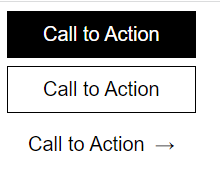

# Ejercicio 1

Partiendo del siguiente html. Crear una hoja de estilos SCSS que cumpla los siguiente requerimientos.

-   Generar las classes necesarias para cumplir los diferentes tipos de visualizacion.
-   Declaracion y uso de variables para cambiar el color de fondo de pagina y los botones.
-   Anidamiento de clases.

```
<button class="button button-primary">Call to Action</button>
<button class="button button-secondary">Call to Action</button>
<button class="button button-tertiary">Call to Action</button>

```


