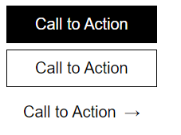
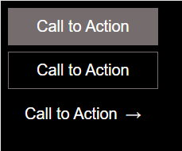

# Ejercicio 4

Partiendo del Ejercicio 1 generar dos clases que permitan cambiar entre tema claro y tema oscuro:

Ejemplo de uso:

```
<body class="theme-light">
    <div class="container">
        <button class="button button-primary">Call to Action</button>
        <button class="button button-secondary">Call to Action</button>
        <button class="button button-tertiary">Call to Action</button>
    </div>
</body>
```



```
<body class="theme-dark">
    <div class="container">
        <button class="button button-primary">Call to Action</button>
        <button class="button button-secondary">Call to Action</button>
        <button class="button button-tertiary">Call to Action</button>
    </div>
</body>
```


